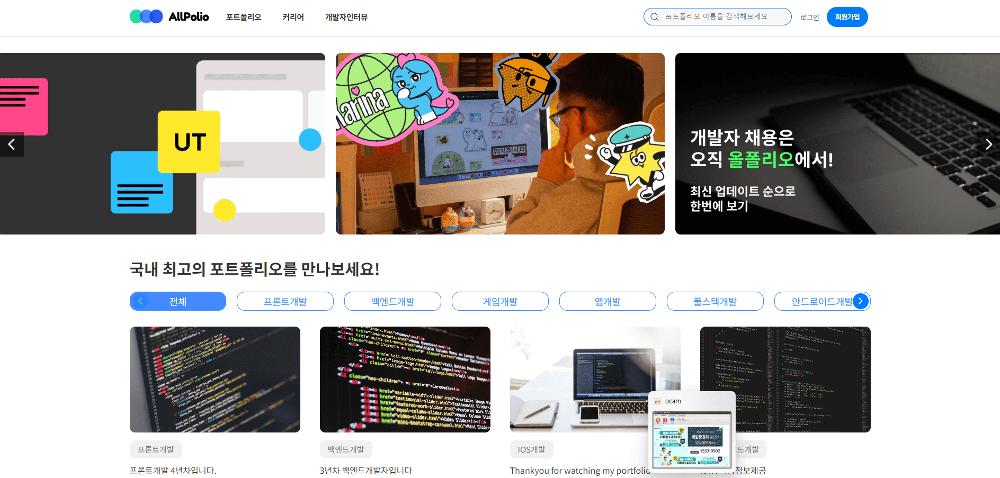
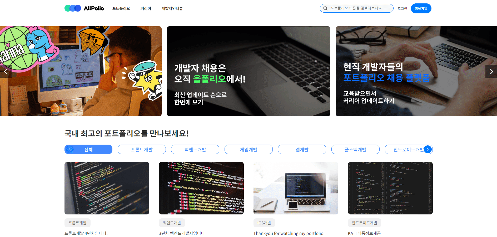

# AllPolio 홈페이지 제작

Demo Link : https://octdoki.github.io/AllPolio/dist

 
 

# 프로젝트 참고 또는 리뉴얼 사이트

1. <a href="https://www.wanted.co.kr/jobsfeed" target="_blank"> 원티드 </a>
2. <a href="https://notefolio.net/" target="_blank"> 노트폴리오 </a>

# 사용 기술  

- [X] React
- [X] Styled-Components
- [X] Axios 
- [X] Router 
- [X] Redux-toolkit

## 프로젝트 요구 사항
1. 카테고리 분류 및 API 개발
2. 팝업 게시물 구현
3. 댓글 등록, 수정, 삭제 구현
4. 로그인 / 로그아웃 좋아요, 팔로우, 내활동 확인 기능 구현
5. 마이페이지 포트폴리오 등록 / 수정 구현
6. 로그인 / 로그아웃 기능 구현

# 프로젝트 기획/제작 과정 

1. 요구사항 명세서 작성

2. 기획서 및 와이어프레임,스토리보드 제작

3.컴포넌트 구성 및 분리 

4.플로우차트 및 스케쥴링표 작성 

# 프로젝트 기능 구현

### 1) 메인 카테고리 분류 및 검색

* swiper slide 배너 
* 카테고리 필터
* 게시물 타이틀 검색 
  

### 2) 메인 게시물 팝업댓글

* 게시물 팝업 - 댓글 등록, 수정 , 삭제
  

### 3) 개발자인터뷰 페이지

* 카테고리 분류
* 상세페이지
* 리스트 검색
* 게시물 페이지네이션
* 추후 보완 및 추가 예정

### 4) 커리어페이지

* 카테고리 분류
* 필터 팝업창 - 최신, 마감, 추천순 / 취업노하우, 
  고민상담소, 개발자로 취업하기, 이벤트 소식 총 2개 필터
* 게시물 팝업 참가신청 / 참가 완료페이지 (마이페이지 연동)
* 게시물 페이지네이션
* 추후 보완 및 추가 예정

### 5) 로그인 / 마이페이지

* 이메일로 로그인 + 인증번호
* 마이페이지 포트폴리오 등록 
* 포트폴리오 등록 시 메인 최신포폴 영역에 추가예정
* 내활동 좋아요, 팔로우 수 수정 및 확인
* 추후 보완 및 추가 예정
  

### 6) 회원가입 / 로컬스토리지

* 회원가입
* 체크박스 전체 / 선택
* 로컬스토리지 저장
* 추후 보완 및 추가 예정
  

#### 배운점  
##### 직무 관련 이해도 향상
* 직접 한 프로젝트의 기획,제작,구현 진행하며 웹서비스가 만들어지는 전반적인 프로세스 이해
##### 팀 협업능력,소통능력
* 주 1회 대면 회의를 통하여 프로젝트 관리를 하고자 하였으며 Slack 등 온라인도 적극적으로 활용.
* FigJam을 통하여 각자 맡은 업무,부분을 공유하고 진행중,진행 완료, 진행 중 문제 발생 으로 나누어 공유하였다. 이와 같은 방식으로 의견을 조율하고 효과적으로 의사소통하는 방법을 배울 수 있었다.
* 리액트와 리덕스를 팀 프로젝트에 활용하여, 팀원들의 코드와 디자인을 이해하고, 피드백을 제공.
